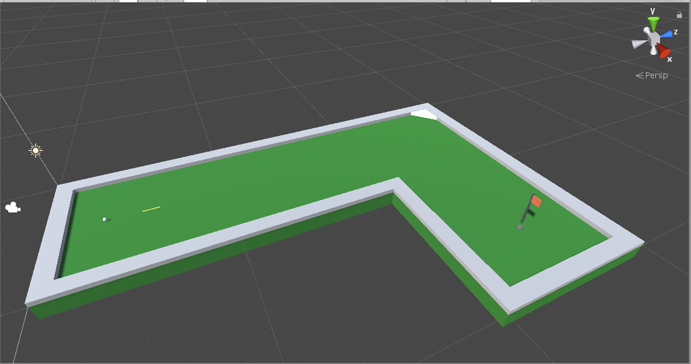

# Golf Mechanics

The purpose of this project is to learn about physics in golf for games in Unity using C#. However, the concepts could also be used in any engines or language.

The end goal of this project is to have
- A driving range scene which allows the user to see shot trajectories based on input parametres similar to [this website](https://flightscope.com/products/trajectory-optimizer/).
- A putting scene for putting lines on different slopes.

Hopefully this project wil help others getting started in golf simulators or mini-putt games.

## Check it out
The project can be played here https://brogan89.github.io/Golf-Mechanics/

# Screen Shots
Mini-Putt

